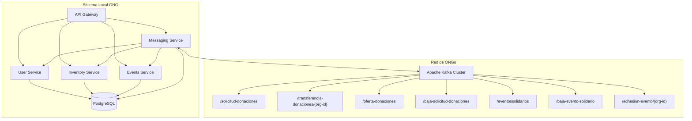

# Documento de Diseño - Sistema de Mensajería para Red de ONGs

## Visión General

El sistema de mensajería para red de ONGs extiende la arquitectura de microservicios existente para permitir la comunicación entre organizaciones mediante Apache Kafka. El diseño integra productores y consumidores de mensajes en los servicios existentes, manteniendo la separación de responsabilidades y agregando nuevas funcionalidades de red colaborativa.

## Arquitectura

### Arquitectura Actual vs Nueva Arquitectura

**Arquitectura Actual:**
- Microservicios independientes (user-service, inventory-service, events-service)
- API Gateway como punto de entrada
- Base de datos PostgreSQL centralizada
- Kafka configurado pero no utilizado

**Nueva Arquitectura:**
- Mismos microservicios con capacidades de mensajería Kafka
- Nuevo servicio: `messaging-service` para centralizar la lógica de Kafka
- Topics específicos para cada tipo de mensaje
- Sincronización bidireccional entre base de datos local y red de ONGs

### Diagrama de Arquitectura



## Componentes y Interfaces

### 1. Messaging Service (Nuevo)

**Responsabilidades:**
- Gestionar conexiones con Kafka
- Producir mensajes a topics específicos
- Consumir mensajes de topics suscritos
- Coordinar con otros servicios para sincronización de datos
- Manejar reintentos y recuperación de errores

**Interfaces:**
```python
class MessagingService:
    def publish_donation_request(self, org_id: str, request_id: str, donations: List[Donation])
    def publish_donation_transfer(self, target_org: str, request_id: str, donations: List[DonationTransfer])
    def publish_donation_offer(self, offer_id: str, org_id: str, donations: List[DonationOffer])
    def publish_request_cancellation(self, org_id: str, request_id: str)
    def publish_event(self, org_id: str, event_id: str, event_data: EventData)
    def publish_event_cancellation(self, org_id: str, event_id: str)
    def publish_event_adhesion(self, target_org: str, event_id: str, volunteer: VolunteerData)
```

### 2. Extensiones a Servicios Existentes

#### Inventory Service
**Nuevas funcionalidades:**
- Procesar transferencias de donaciones entrantes/salientes
- Gestionar ofertas de donaciones
- Validar disponibilidad antes de transferencias

#### Events Service
**Nuevas funcionalidades:**
- Publicar eventos en la red
- Gestionar eventos externos
- Procesar adhesiones de voluntarios externos

#### User Service
**Nuevas funcionalidades:**
- Gestionar datos de voluntarios para adhesiones
- Validar permisos para operaciones de red

### 3. Nuevas Entidades de Datos

```python
# Modelos para mensajería
@dataclass
class DonationRequest:
    organization_id: str
    request_id: str
    donations: List[DonationItem]
    timestamp: datetime

@dataclass
class DonationTransfer:
    request_id: str
    donor_organization: str
    donations: List[DonationTransferItem]
    timestamp: datetime

@dataclass
class DonationOffer:
    offer_id: str
    donor_organization: str
    donations: List[DonationOfferItem]
    timestamp: datetime

@dataclass
class ExternalEvent:
    organization_id: str
    event_id: str
    name: str
    description: str
    event_date: datetime
    timestamp: datetime

@dataclass
class EventAdhesion:
    event_id: str
    volunteer: VolunteerInfo
    organization_id: str
    timestamp: datetime
```

## Modelos de Datos

### Extensiones a Base de Datos Existente

```sql
-- Tabla para ofertas de donaciones externas
CREATE TABLE ofertas_externas (
    id SERIAL PRIMARY KEY,
    organizacion_donante VARCHAR(100) NOT NULL,
    oferta_id VARCHAR(100) NOT NULL,
    donaciones JSONB NOT NULL,
    activa BOOLEAN DEFAULT true,
    fecha_creacion TIMESTAMP DEFAULT CURRENT_TIMESTAMP,
    UNIQUE(organizacion_donante, oferta_id)
);

-- Tabla para adhesiones a eventos externos
CREATE TABLE adhesiones_eventos_externos (
    id SERIAL PRIMARY KEY,
    evento_externo_id INTEGER REFERENCES eventos_externos(id),
    voluntario_id INTEGER REFERENCES usuarios(id),
    fecha_adhesion TIMESTAMP DEFAULT CURRENT_TIMESTAMP,
    estado VARCHAR(20) DEFAULT 'PENDIENTE' CHECK (estado IN ('PENDIENTE', 'CONFIRMADA', 'CANCELADA')),
    UNIQUE(evento_externo_id, voluntario_id)
);

-- Tabla para historial de transferencias
CREATE TABLE transferencias_donaciones (
    id SERIAL PRIMARY KEY,
    tipo VARCHAR(20) NOT NULL CHECK (tipo IN ('ENVIADA', 'RECIBIDA')),
    organizacion_contraparte VARCHAR(100) NOT NULL,
    solicitud_id VARCHAR(100),
    donaciones JSONB NOT NULL,
    fecha_transferencia TIMESTAMP DEFAULT CURRENT_TIMESTAMP
);

-- Tabla para configuración de la organización
CREATE TABLE configuracion_organizacion (
    id SERIAL PRIMARY KEY,
    clave VARCHAR(100) UNIQUE NOT NULL,
    valor TEXT NOT NULL,
    fecha_actualizacion TIMESTAMP DEFAULT CURRENT_TIMESTAMP
);

-- Insertar ID de organización
INSERT INTO configuracion_organizacion (clave, valor) 
VALUES ('ORGANIZATION_ID', 'empuje-comunitario');
```

### Estructura de Mensajes Kafka

#### Topic: /solicitud-donaciones
```json
{
  "organization_id": "empuje-comunitario",
  "request_id": "REQ-2024-001",
  "donations": [
    {
      "category": "ALIMENTOS",
      "description": "Puré de tomates"
    }
  ],
  "timestamp": "2024-01-15T10:30:00Z"
}
```

#### Topic: /transferencia-donaciones/{org-id}
```json
{
  "request_id": "REQ-2024-001",
  "donor_organization": "empuje-comunitario",
  "donations": [
    {
      "category": "ALIMENTOS",
      "description": "Puré de tomates",
      "quantity": "2kg"
    }
  ],
  "timestamp": "2024-01-15T11:00:00Z"
}
```

## Manejo de Errores

### Estrategias de Recuperación

1. **Reintentos Automáticos:**
   - Reintentos exponenciales para fallos de conectividad
   - Máximo 3 reintentos por mensaje
   - Dead Letter Queue para mensajes fallidos

2. **Validación de Datos:**
   - Validación de esquemas JSON antes de procesar
   - Verificación de integridad referencial
   - Logs detallados para debugging

3. **Manejo de Duplicados:**
   - Claves de idempotencia en mensajes
   - Verificación de duplicados antes de procesar
   - Timestamps para ordenamiento de mensajes

### Códigos de Error

```python
class MessagingError(Exception):
    KAFKA_CONNECTION_ERROR = "KAFKA_001"
    INVALID_MESSAGE_FORMAT = "MSG_001"
    DUPLICATE_MESSAGE = "MSG_002"
    INSUFFICIENT_INVENTORY = "INV_001"
    ORGANIZATION_NOT_FOUND = "ORG_001"
```

## Estrategia de Testing

### Testing Unitario
- Tests para cada productor y consumidor de mensajes
- Mocks de Kafka para testing aislado
- Validación de formatos de mensajes

### Testing de Integración
- Tests con Kafka embebido
- Verificación de flujos completos de mensajería
- Tests de sincronización de base de datos

### Testing End-to-End
- Simulación de múltiples organizaciones
- Verificación de flujos completos de colaboración
- Tests de recuperación ante fallos

### Herramientas de Testing
```python
# Configuración de testing con Kafka embebido
class KafkaTestConfig:
    KAFKA_BOOTSTRAP_SERVERS = "localhost:9093"
    TEST_TOPICS = [
        "test-solicitud-donaciones",
        "test-transferencia-donaciones",
        "test-oferta-donaciones"
    ]
```

## Configuración y Deployment

### Variables de Entorno
```bash
# Configuración Kafka
KAFKA_BROKERS=kafka:9092
KAFKA_GROUP_ID=empuje-comunitario-group
ORGANIZATION_ID=empuje-comunitario

# Configuración de reintentos
KAFKA_RETRY_ATTEMPTS=3
KAFKA_RETRY_DELAY=1000

# Configuración de topics
KAFKA_AUTO_CREATE_TOPICS=true
KAFKA_REPLICATION_FACTOR=1
```

### Docker Compose Updates
```yaml
messaging-service:
  build:
    context: ./messaging-service
    dockerfile: Dockerfile
  container_name: ong_messaging_service
  ports:
    - "50054:50054"
  environment:
    - KAFKA_BROKERS=kafka:9092
    - ORGANIZATION_ID=empuje-comunitario
    - DB_HOST=postgres
    - DB_NAME=ong_management
    - DB_USER=ong_user
    - DB_PASSWORD=ong_pass
  depends_on:
    - postgres
    - kafka
  networks:
    - ong_network
```

## Consideraciones de Seguridad

### Autenticación y Autorización
- Validación de ID de organización en mensajes
- Verificación de permisos para operaciones sensibles
- Logs de auditoría para todas las operaciones de red

### Validación de Datos
- Sanitización de inputs antes de publicar mensajes
- Validación de esquemas JSON estricta
- Límites de tamaño para mensajes

### Monitoreo
- Métricas de Kafka (throughput, latencia, errores)
- Alertas para fallos de conectividad
- Dashboard de estado de la red de ONGs

## Migración y Compatibilidad

### Plan de Migración
1. Desplegar messaging-service sin activar consumidores
2. Actualizar servicios existentes con capacidades de producción
3. Activar consumidores gradualmente por topic
4. Monitorear y ajustar configuraciones

### Compatibilidad hacia atrás
- Servicios existentes siguen funcionando sin cambios
- Nuevas funcionalidades son opcionales
- Configuración por feature flags para activar/desactivar mensajería