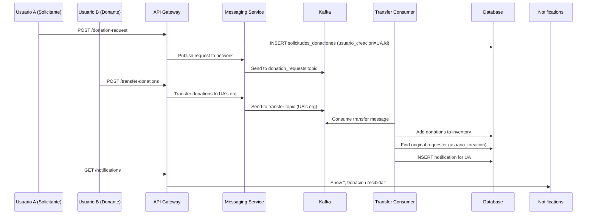

# 🔔 Implementación - Notificaciones de Transferencias

## ❌ **PROBLEMA IDENTIFICADO**

Cuando se hace una transferencia distribuida, el usuario que pidió la donación no recibe notificación de que su solicitud fue atendida.

## ✅ **SOLUCIÓN IMPLEMENTADA**

### 📋 **Flujo Completo de Notificaciones**

1. **Usuario A** hace una solicitud de donaciones → Se guarda en `solicitudes_donaciones`
2. **Usuario B** ve la solicitud y decide transferir donaciones
3. **Sistema** envía transferencia vía Kafka al topic de la organización receptora
4. **Consumer de transferencias** procesa la transferencia entrante
5. **Sistema** busca al usuario original que hizo la solicitud
6. **Sistema** envía notificación al usuario original
7. **Usuario A** recibe notificación de que su solicitud fue atendida

### 🔧 **Modificaciones Realizadas**

#### 1. **Consumer de Transferencias Mejorado** (`transfer_consumer.py`)

```python
def _process_incoming_transfer(self, transfer: DonationTransfer) -> bool:
    # ... procesamiento existente ...
    
    # Send notification to the user who made the original request
    self._notify_request_fulfilled(cursor, transfer)
    
    # Commit transaction
    conn.commit()
    return True
```

#### 2. **Nuevo Método de Notificación**

```python
def _notify_request_fulfilled(self, cursor, transfer: DonationTransfer):
    """Send notification to user who made the original request"""
    
    # Find the user who made the original request
    query = """
        SELECT sd.usuario_creacion, u.nombre, u.apellido
        FROM solicitudes_donaciones sd
        LEFT JOIN usuarios u ON sd.usuario_creacion = u.id
        WHERE sd.solicitud_id = %s
        LIMIT 1
    """
    cursor.execute(query, (transfer.request_id,))
    result = cursor.fetchone()
    
    if result:
        user_id, user_name, user_surname = result
        
        # Create notification content
        title = "🎁 ¡Donación recibida!"
        message = f"""¡Excelente noticia {user_full_name}!

La organización '{transfer.donor_organization}' ha respondido a tu solicitud de donaciones.

Donaciones recibidas:
{donations_text}

Las donaciones ya están disponibles en tu inventario. ¡Gracias por usar la red de colaboración!"""
        
        # Insert notification
        cursor.execute(notification_query, (user_id, title, message, 'SUCCESS'))
```

### 📧 **Formato de Notificación**

#### **Título**: 🎁 ¡Donación recibida!

#### **Mensaje**:
```
¡Excelente noticia [Nombre Usuario]!

La organización '[Organización Donante]' ha respondido a tu solicitud de donaciones.

Donaciones recibidas:
• Arroz integral (5kg)
• Camisetas (10 unidades)
• Medicamentos básicos (20 unidades)

Las donaciones ya están disponibles en tu inventario. ¡Gracias por usar la red de colaboración!
```

#### **Tipo**: SUCCESS (badge verde)

### 🔄 **Flujo Técnico Detallado**



### 📊 **Datos Involucrados**

#### **Tabla `solicitudes_donaciones`**:
```sql
CREATE TABLE solicitudes_donaciones (
    id INT AUTO_INCREMENT PRIMARY KEY,
    solicitud_id VARCHAR(100) UNIQUE NOT NULL,
    donaciones JSON NOT NULL,
    usuario_creacion INT,  -- ← Usuario que hizo la solicitud
    fecha_creacion TIMESTAMP DEFAULT CURRENT_TIMESTAMP,
    FOREIGN KEY (usuario_creacion) REFERENCES usuarios(id)
);
```

#### **Tabla `notificaciones_usuarios`**:
```sql
CREATE TABLE notificaciones_usuarios (
    id INT AUTO_INCREMENT PRIMARY KEY,
    usuario_id INT NOT NULL,  -- ← Usuario que recibe la notificación
    titulo VARCHAR(255) NOT NULL,
    mensaje TEXT NOT NULL,
    tipo ENUM('INFO', 'SUCCESS', 'WARNING', 'ERROR') DEFAULT 'INFO',
    fecha_creacion TIMESTAMP DEFAULT CURRENT_TIMESTAMP,
    leida BOOLEAN DEFAULT FALSE
);
```

### 🧪 **Cómo Probar la Funcionalidad**

#### **Método 1: Test Automatizado**
```bash
python test_transfer_notifications.py
```

#### **Método 2: Test Manual**
1. **Iniciar sesión como Usuario A** (ej: esperanza_admin)
2. **Crear solicitud de donaciones** en "Red de ONGs" → "Solicitudes Red"
3. **Iniciar sesión como Usuario B** (ej: admin de empuje-comunitario)
4. **Ver solicitudes externas** y transferir donaciones
5. **Volver a Usuario A** y verificar notificaciones
6. **Debería aparecer**: "🎁 ¡Donación recibida!"

#### **Método 3: Verificación en Base de Datos**
```sql
-- Verificar solicitudes
SELECT * FROM solicitudes_donaciones ORDER BY fecha_creacion DESC LIMIT 5;

-- Verificar transferencias
SELECT * FROM transferencias_donaciones ORDER BY fecha_transferencia DESC LIMIT 5;

-- Verificar notificaciones
SELECT * FROM notificaciones_usuarios 
WHERE titulo LIKE '%donación%' 
ORDER BY fecha_creacion DESC LIMIT 5;
```

### 🔧 **Características de la Implementación**

#### ✅ **Funcionalidades**:
- **Notificación automática** cuando se recibe una transferencia
- **Identificación del usuario original** que hizo la solicitud
- **Contenido personalizado** con detalles de las donaciones
- **Manejo de errores** (no rompe el proceso si falla la notificación)
- **Logging detallado** para debugging

#### ✅ **Seguridad**:
- Solo notifica al usuario que hizo la solicitud original
- Validación de datos antes de crear notificación
- Transacciones de base de datos para consistencia

#### ✅ **Experiencia de Usuario**:
- Notificación inmediata cuando se recibe donación
- Información clara sobre qué se recibió y de quién
- Emoji y formato amigable
- Tipo SUCCESS para feedback positivo

### 📝 **Archivos Modificados**

1. **messaging-service/src/messaging/consumers/transfer_consumer.py**
   - Agregado método `_notify_request_fulfilled()`
   - Integrado en el flujo de procesamiento de transferencias
   - Consulta a base de datos para encontrar usuario original

### 🎯 **Resultado Esperado**

**Cuando un usuario hace una solicitud de donaciones y otra organización le transfiere donaciones, el usuario original recibirá automáticamente una notificación informándole que su solicitud fue atendida, con detalles de las donaciones recibidas.**

---

## 🚀 **PRÓXIMOS PASOS PARA PROBAR**

1. **Reiniciar el Messaging Service** (para aplicar cambios)
2. **Hacer una solicitud de donaciones** desde una organización
3. **Transferir donaciones** desde otra organización
4. **Verificar que llegue la notificación** al usuario solicitante
5. **Confirmar el contenido** de la notificación