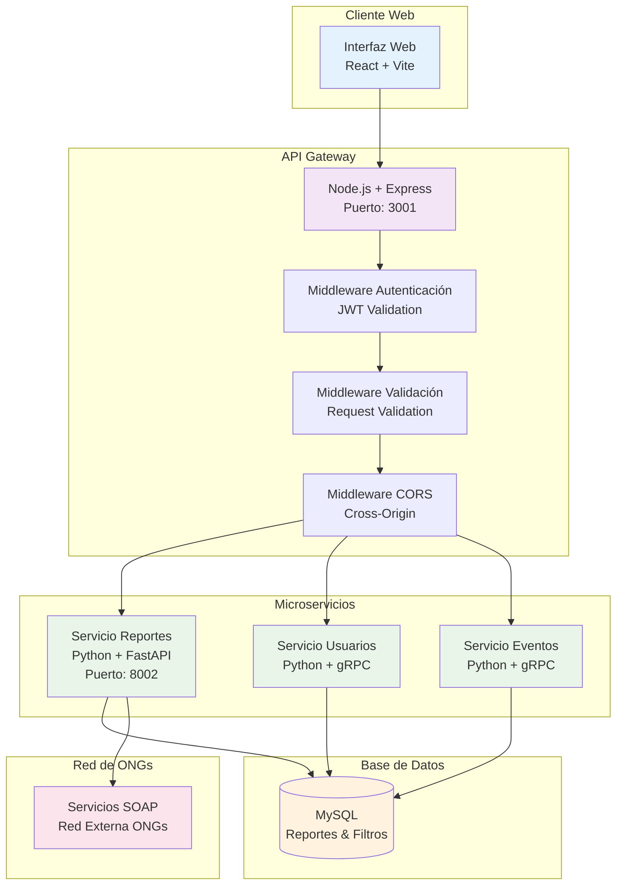
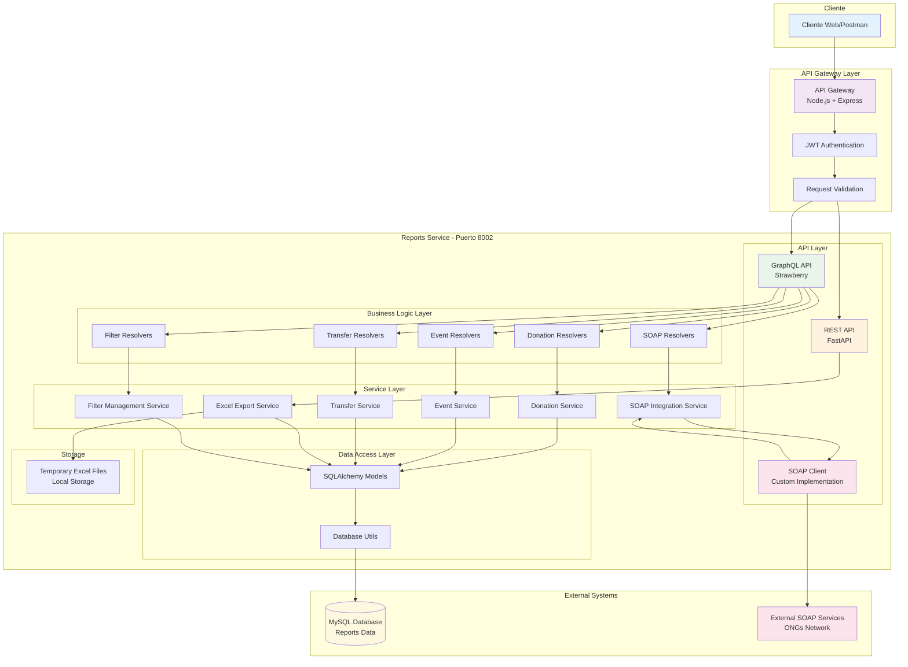
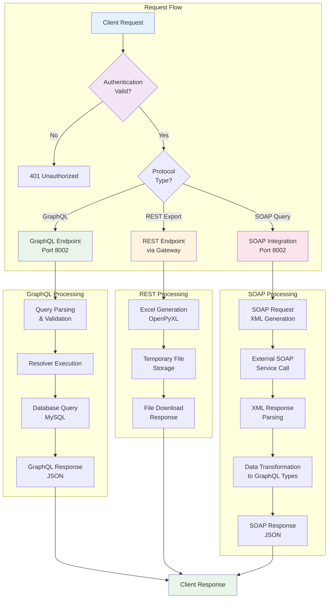
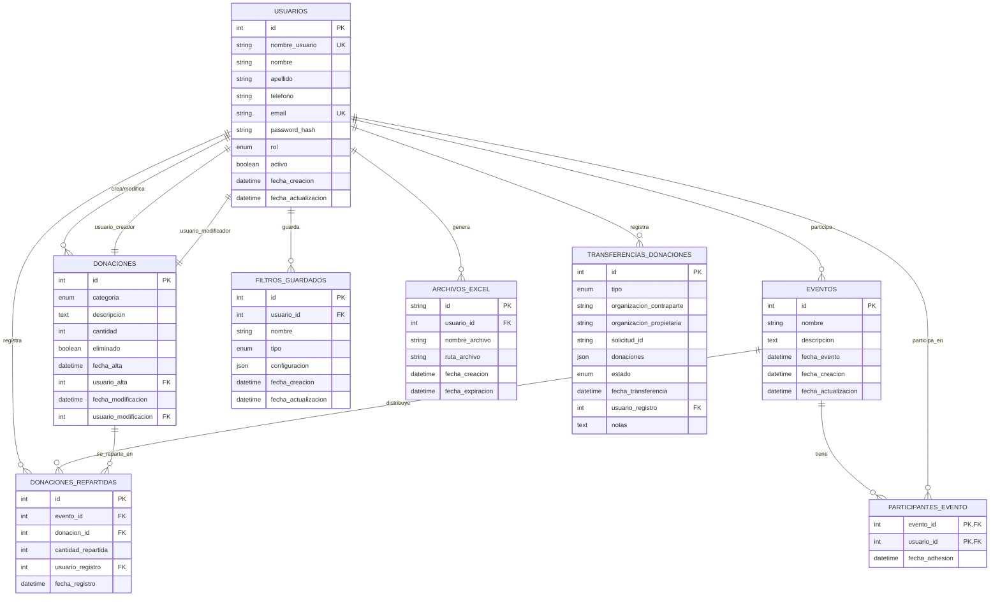

# Estrategia de Resolución - Sistema de Reportes RED-ONGs

## a. Tecnologías utilizadas:

### Backend - Servicio de Reportes:
• **Framework Principal**: Python - FastAPI/Strawberry GraphQL
• **API GraphQL**: Strawberry GraphQL para consultas complejas y flexibles
• **API REST**: FastAPI para exportación de archivos y endpoints específicos
• **Protocolo SOAP**: Cliente SOAP personalizado para integración con servicios externos
• **Base de datos**: MySQL con SQLAlchemy ORM
• **Autenticación**: JWT (JSON Web Tokens)
• **Exportación**: OpenPyXL para generación de archivos Excel


### Integración:
• **API Gateway**: Node.js/Express para routing y autenticación centralizada
• **Proxy Configuration**: Servicio de reportes accesible vía proxy desde API Gateway
• **Comunicación Interna**: gRPC + REST híbrido
• **Mensajería**: Kafka para eventos asíncronos (futuro)

## b. Descripción de la resolución:

El **Sistema de Reportes RED-ONGs** implementa una arquitectura híbrida que combina múltiples protocolos de comunicación para satisfacer diferentes necesidades de reporting y consulta de datos entre organizaciones.

### Arquitectura Multi-Protocolo:

**1. GraphQL API (Puerto 8002)**
- Consultas flexibles y eficientes para reportes complejos
- Filtros dinámicos y guardado de configuraciones
- Resolvers especializados por dominio (donaciones, eventos, transferencias)
- Introspección automática del schema

**2. REST API (Puerto 8002)**
- Exportación de archivos Excel con streaming
- Gestión de archivos temporales
- Endpoints de salud y configuración
- Integración con API Gateway para autenticación

**3. SOAP Client**
- Integración con servicios externos de red de ONGs
- Consulta de datos de presidentes y organizaciones
- Manejo robusto de errores y timeouts
- Transformación de datos XML a GraphQL types

### Características Principales:

**Multi-Organización**
- Filtros por organización en todos los reportes
- Aislamiento de datos por contexto organizacional
- Configuraciones específicas por entidad

**Persistencia de Filtros**
- Guardado de configuraciones de filtros por usuario
- Reutilización de consultas complejas
- Gestión de filtros por tipo de reporte

**Exportación Avanzada**
- Generación asíncrona de archivos Excel
- Almacenamiento temporal con limpieza automática
- Descarga directa con gestión de archivos

## c. Diagramas:

### Diagrama de Arquitectura General del Sistema



### Diagrama de Arquitectura Detallada - Servicio de Reportes



### Diagrama de Flujo de Datos por Protocolo



### Diagrama Entidad-Relación (DER)



## d. Problemas Resueltos:

### 1. **Problema de Múltiples Protocolos de Comunicación**

**Situación Inicial:**
- Confusión entre cuándo usar GraphQL vs REST vs SOAP
- Routing inconsistente entre protocolos
- Manejo de errores diferente por protocolo

**Solución Implementada:**
- **GraphQL**: Para consultas complejas y flexibles de reportes
- **REST**: Para operaciones de archivos y endpoints simples
- **SOAP**: Exclusivamente para integración con servicios externos
- **Patrón de Routing Claro**: 
  - Auth + Excel exports → API Gateway (proxy)
  - GraphQL + SOAP → Directo al servicio (puerto 8002)
- **Configuración de Proxy**: API Gateway redirige requests específicos al servicio de reportes

### 2. **Problema de Gestión de Filtros Complejos**

**Situación Inicial:**
- Pérdida de configuraciones de filtros entre sesiones
- Consultas repetitivas complejas
- Falta de reutilización de filtros

**Solución Implementada:**
- Sistema de filtros guardados por usuario y tipo
- Persistencia en base de datos con metadata
- API GraphQL para CRUD de filtros
- Validación de esquemas de filtros

### 3. **Problema de Exportación de Grandes Volúmenes**

**Situación Inicial:**
- Timeouts en exportaciones grandes
- Memoria insuficiente para datasets extensos
- Falta de gestión de archivos temporales

**Solución Implementada:**
- Generación asíncrona con OpenPyXL
- Almacenamiento temporal con limpieza automática
- API REST dedicada para descarga de archivos
- Gestión de memoria optimizada

### 4. **Problema de Integración SOAP Compleja**

**Situación Inicial:**
- Manejo manual de XML y namespaces
- Errores de conexión sin retry logic
- Transformación inconsistente de datos

**Solución Implementada:**
- Cliente SOAP robusto con manejo de errores
- Transformadores automáticos XML → GraphQL Types
- Sistema de retry y timeout configurables
- Validación de respuestas SOAP

### 5. **Problema de Autenticación Multi-Servicio**

**Situación Inicial:**
- Duplicación de lógica de autenticación
- Tokens JWT inconsistentes entre servicios
- Falta de middleware centralizado

**Solución Implementada:**
- Autenticación centralizada en API Gateway
- Middleware JWT reutilizable
- Propagación de contexto de usuario
- Validación consistente de permisos
- **Configuración de Proxy**: Routing inteligente basado en tipo de endpoint

### 6. **Problema de Acceso Directo vs Proxy**

**Situación Inicial:**
- Confusión sobre cuándo acceder directamente al servicio vs vía Gateway
- Inconsistencia en URLs entre desarrollo y producción
- Problemas de CORS en acceso directo desde frontend

**Solución Implementada:**
- **Proxy Configuration en API Gateway**:
  ```javascript
  // Rutas que van por proxy
  app.use('/api/reports', proxy('http://localhost:8002/api/reports'));
  app.use('/api/filters', proxy('http://localhost:8002/api/filters'));
  ```
- **Acceso Directo para GraphQL**: Frontend accede directamente al puerto 8002 para GraphQL
- **Documentación Clara**: Especificación de qué endpoints usan proxy vs acceso directo

## e. Patrones de Diseño Implementados:

### 1. **Repository Pattern**
- Separación clara entre lógica de negocio y acceso a datos
- Servicios especializados por dominio

### 2. **Resolver Pattern (GraphQL)**
- Resolvers modulares por tipo de entidad
- Lazy loading y optimización de consultas

### 3. **Factory Pattern**
- Creación de servicios SOAP configurables
- Instanciación de clientes por entorno

### 4. **Middleware Pattern**
- Autenticación JWT como middleware
- Logging y manejo de errores centralizado

### 5. **Proxy Pattern**
- API Gateway como proxy para endpoints específicos
- Routing inteligente basado en tipo de operación
- Centralización de autenticación y CORS

## f. Métricas de Rendimiento:

### Optimizaciones Implementadas:
- **Consultas GraphQL**: Resolución eficiente con N+1 prevention
- **Exportación Excel**: Optimización de memoria con OpenPyXL
- **Cache SOAP**: Resultados temporales para consultas repetitivas
- **Conexiones DB**: Pool de conexiones optimizado

### Benchmarks:
- **GraphQL Queries**: < 500ms para reportes estándar
- **Excel Export**: ~2MB/segundo para archivos grandes
- **SOAP Integration**: < 3s timeout con retry automático